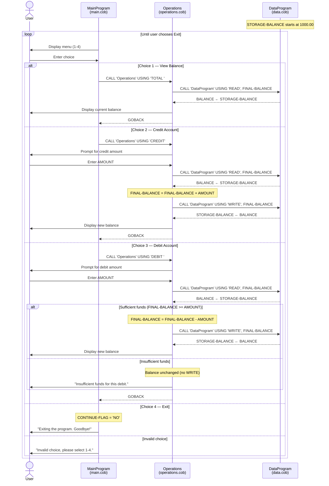

# COBOL Account Management System — Documentation

This document describes the legacy COBOL student account management application under `src/cobol/`. The system provides a simple interactive console interface for viewing and updating a student account balance.

## Overview

The application is split into three COBOL programs that work together:

| File | Program ID | Role |
|------|------------|------|
| [`src/cobol/main.cob`](../src/cobol/main.cob) | `MainProgram` | Menu-driven entry point and user interaction loop |
| [`src/cobol/operations.cob`](../src/cobol/operations.cob) | `Operations` | Business operations: view balance, credit, debit |
| [`src/cobol/data.cob`](../src/cobol/data.cob) | `DataProgram` | In-memory balance storage and read/write access |

```
MainProgram
    │
    ├── CALL Operations('TOTAL ')  → view balance
    ├── CALL Operations('CREDIT')  → credit account
    ├── CALL Operations('DEBIT ')  → debit account
    │
    └── Operations
            │
            └── CALL DataProgram('READ' | 'WRITE', balance)
```

---

## File Reference

### `main.cob` — Main Program

**Purpose:** Application entry point. Presents the account management menu and dispatches user choices to the operations layer.

**Key elements:**

| Name | Type | Description |
|------|------|-------------|
| `USER-CHOICE` | `PIC 9` | Menu option selected by the user (1–4) |
| `CONTINUE-FLAG` | `PIC X(3)` | Loop control; set to `'NO'` to exit |
| `MAIN-LOGIC` | Paragraph | Main menu loop until the user exits |

**Menu options:**

1. **View Balance** — Calls `Operations` with `'TOTAL '`
2. **Credit Account** — Calls `Operations` with `'CREDIT'`
3. **Debit Account** — Calls `Operations` with `'DEBIT '`
4. **Exit** — Sets `CONTINUE-FLAG` to `'NO'` and ends the program

**Behavior notes:**

- Invalid choices (anything other than 1–4) display an error and redisplay the menu.
- Operation codes passed to `Operations` are fixed-width `PIC X(6)` values and must match exactly (including trailing spaces where present).

---

### `operations.cob` — Operations Program

**Purpose:** Implements student account business operations. Accepts an operation type from the main program, interacts with the user for amounts when needed, and reads/writes the balance via `DataProgram`.

**Key elements:**

| Name | Type | Description |
|------|------|-------------|
| `PASSED-OPERATION` | Linkage `PIC X(6)` | Operation requested by the caller |
| `OPERATION-TYPE` | Working storage | Local copy of the requested operation |
| `AMOUNT` | `PIC 9(6)V99` | Credit or debit amount entered by the user |
| `FINAL-BALANCE` | `PIC 9(6)V99` | Working copy of the account balance |

**Supported operations:**

| Operation code | Action |
|----------------|--------|
| `TOTAL ` | Read balance from `DataProgram` and display it |
| `CREDIT` | Prompt for amount, add to balance, write updated balance, display new balance |
| `DEBIT ` | Prompt for amount, validate funds, subtract if allowed, write balance, display result |

**Call interface:**

```cobol
CALL 'Operations' USING operation-code
```

Where `operation-code` is a 6-character string (`TOTAL `, `CREDIT`, or `DEBIT `).

---

### `data.cob` — Data Program

**Purpose:** Acts as the data access layer for the student account balance. Holds the balance in working storage and supports read and write operations through the linkage section.

**Key elements:**

| Name | Type | Description |
|------|------|-------------|
| `STORAGE-BALANCE` | `PIC 9(6)V99` | Persistent in-memory account balance |
| `OPERATION-TYPE` | `PIC X(6)` | Local copy of `'READ'` or `'WRITE'` |
| `PASSED-OPERATION` | Linkage `PIC X(6)` | Operation requested by the caller |
| `BALANCE` | Linkage `PIC 9(6)V99` | Balance value passed in or out |

**Supported operations:**

| Operation code | Action |
|----------------|--------|
| `READ` | Copy `STORAGE-BALANCE` into the linkage `BALANCE` field |
| `WRITE` | Copy the linkage `BALANCE` field into `STORAGE-BALANCE` |

**Call interface:**

```cobol
CALL 'DataProgram' USING operation-code, balance-field
```

**Storage characteristics:**

- Balance is stored only in memory for the life of the program run (not on disk).
- Initial balance is **1000.00**.
- Balance format supports up to 6 integer digits and 2 decimal places (`PIC 9(6)V99`), i.e. values from `0.00` through `999999.99`.

---

## Business Rules — Student Accounts

The following rules are enforced by the current COBOL implementation:

1. **Opening balance**  
   Every run starts with a student account balance of **1000.00**.

2. **Credit (deposit)**  
   - Any positive amount the user enters is added to the current balance.  
   - There is no upper limit check beyond the `PIC 9(6)V99` field capacity.  
   - The updated balance is saved immediately via `DataProgram` (`WRITE`).

3. **Debit (withdrawal)**  
   - A debit is allowed only when **current balance ≥ debit amount**.  
   - If funds are insufficient, the balance is **not** changed and the message `"Insufficient funds for this debit."` is displayed.  
   - On success, the amount is subtracted, the new balance is written, and the updated balance is displayed.

4. **Balance inquiry**  
   - Viewing the balance is read-only; it does not modify stored data.

5. **No overdraft**  
   - The account cannot go negative. Debits that would produce a negative balance are rejected.

6. **Single account model**  
   - The system manages one in-memory balance only (no multi-student accounts, account numbers, or authentication).

7. **Session-scoped data**  
   - Balance changes persist only for the current program execution. Restarting the application resets the balance to **1000.00**.

---

## Operation Flow Examples

### View balance

1. User selects menu option `1`.
2. `MainProgram` calls `Operations` with `'TOTAL '`.
3. `Operations` calls `DataProgram` with `'READ'`.
4. Current balance is displayed.

### Credit account

1. User selects menu option `2`.
2. `Operations` prompts for a credit amount.
3. Balance is read, amount is added, balance is written back.
4. New balance is displayed.

### Debit account

1. User selects menu option `3`.
2. `Operations` prompts for a debit amount.
3. Balance is read.
4. If `balance >= amount`, amount is subtracted and balance is written; otherwise the debit is rejected with an insufficient-funds message.

---

## Source Layout

```
src/cobol/
├── main.cob         # Menu and program control
├── operations.cob   # Credit, debit, and balance inquiry logic
└── data.cob         # Balance storage and access
```

---

## Sequence Diagram — Application Data Flow

The diagram below shows how the user, `MainProgram`, `Operations`, and `DataProgram` interact for balance inquiry, credit, and debit (including the insufficient-funds path).


